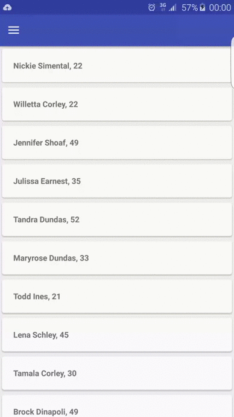

Paginate
============

[](https://android-arsenal.com/details/1/2797)

Android library for creating simple pagination functionality (aka infinite scrolling) upon `RecyclerView` or
`AbsListView`.

Features
--------
* Configuration allows you to setup automatic adding/removing of the loading list item (enabled by default)
* Custom loading list item - inflate and bind (default loading list item view will be used if custom one is not
provided)
* Custom `SpanSizeLookup` for the loading list item when `GridLayoutManager` is used (by default loading list item
will use full span)
* Custom loading trigger threshold
* Support `RecyclerView` (using linear, grid and staggered `LayoutManager`) and `AbsListView` (`ListView` | `GridView`)

Demo
--------
For a working implementation of this project see the `paginate-sample/` folder.



Setup
--------

Gradle:
```groovy
compile 'com.github.markomilos:paginate:1.0.0'
```
or Maven:
```xml
<dependency>
  <groupId>com.github.markomilos</groupId>
  <artifactId>paginate</artifactId>
  <version>1.0.0</version>
</dependency>
```

Usage
--------

Implement `Paginate.Callbacks`

```java
Paginate.Callbacks callbacks = new Paginate.Callbacks() {
    @Override
    public void onLoadMore() {
        // Load next page of data (e.g. network or database)
    }

    @Override
    public boolean isLoading() {
        // Indicate whether new page loading is in progress or not
        return loadingInProgress;
    }

    @Override
    public boolean hasLoadedAllItems() {
        // Indicate whether all data (pages) are loaded or not
        return hasLoadedAllItems;
    }
};
```

**RecyclerView**

```java
Paginate.with(recyclerView, callbacks)
        .setLoadingTriggerThreshold(2)
        .addLoadingListItem(true)
        .setLoadingListItemCreator(new CustomLoadingListItemCreator())
        .setLoadingListItemSpanSizeLookup(new CustomLoadingListItemSpanLookup())
        .build();
```

**Note**: `LayoutManager` and `RecyclerView.Adapter` needs to be set before calling the code above.

Implement `LoadingListItemCreator` in order to provide custom loading row view.

```java
private class CustomLoadingListItemCreator implements LoadingListItemCreator {
    @Override
    public RecyclerView.ViewHolder onCreateViewHolder(ViewGroup parent, int viewType) {
        LayoutInflater inflater = LayoutInflater.from(parent.getContext());
        View view = inflater.inflate(R.layout.custom_loading_list_item, parent, false);
        return new VH(view);
    }

    @Override
    public void onBindViewHolder(RecyclerView.ViewHolder holder, int position) {
        // Bind custom loading row if needed
    }
}
```

**AbsListView**

```java
Paginate.with(absListView, callbacks)
        .setOnScrollListener(scrollListener) // Delegate scroll listener
        .setLoadingTriggerThreshold(2)
        .addLoadingListItem(true)
        .setLoadingListItemCreator(new CustomLoadingListItemCreator())
        .build();
```

**Note**: Adapter needs to be set before calling the code above.

Implement `LoadingListItemCreator` in order to provide custom loading row view.

```java
private class CustomLoadingListItemCreator implements LoadingListItemCreator {
    @Override
    public View newView(int position, ViewGroup parent) {
        LayoutInflater inflater = LayoutInflater.from(parent.getContext());
        View view = inflater.inflate(R.layout.custom_loading_list_item, parent, false);
        view.setTag(new VH(view));
        return view;
    }

    @Override
    public void bindView(int position, View view) {
        // Bind custom loading row if needed
    }
}
```

**Paginate instance**

Calling `build()` upon `Paginate.Builder` will return `Paginate` instance which will allow you to:

* `unbind()` - Call unbind to detach list (`RecyclerView` or `AbsListView`) from Paginate when pagination functionality
is no longer needed on the list. Paginate is using scroll listeners and adapter data observers in order to perform
required checks (when list is scrolled to the end or when new data is added to source adapter). It wraps original
(source) adapter with new adapter that provides loading row if loading row is used. When unbind is called original
adapter will be set on the list and scroll listeners and data observers will be detached.
**You need to call `unbind()` if you re-setup recycler view (e.g. change adapter, layout manager etc)**

* `setHasMoreDataToLoad(boolean)` - if you are using loading row (which is default setup), each time when you add
data to adapter check will be performed and if there is no more data to load loading row will be removed. That means
that loading row will be added/removed automatically. Use this method to explicitly (manually) notify that there is no
more item to load.


Developed By
--------
Marko Milos (marko.milos.hr@gmail.com)

<a href="https://twitter.com/mysterymarks">
  
</a>
<a href="https://hr.linkedin.com/in/markomilos">
  
</a>


License
--------

    Copyright 2020 Marko Milos

    Licensed under the Apache License, Version 2.0 (the "License");
    you may not use this file except in compliance with the License.
    You may obtain a copy of the License at

       http://www.apache.org/licenses/LICENSE-2.0

    Unless required by applicable law or agreed to in writing, software
    distributed under the License is distributed on an "AS IS" BASIS,
    WITHOUT WARRANTIES OR CONDITIONS OF ANY KIND, either express or implied.
    See the License for the specific language governing permissions and
    limitations under the License.